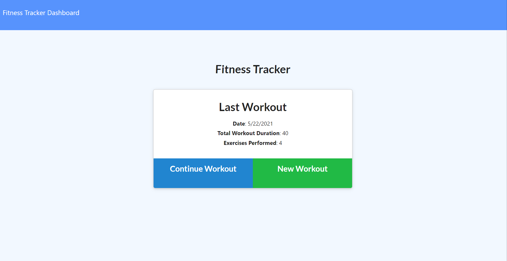

# Workout Tracker

## [Deployed Project](https://thawing-depths-08439.herokuapp.com/?id=60a9b4f1a16671001598da46)

## Project Description

The purpose of this project was to create a workout tracking application that uses a Mongo database with a Mongoose schema and handles routes with Express.

## User Story

* As a user, I want to be able to view create and track daily workouts. I want to be able to log multiple exercises in a workout on a given day. I should also be able to track the name, type, weight, sets, reps, and duration of exercise. If the exercise is a cardio exercise, I should be able to track my distance traveled.

The user can:

  * Add exercises to the most recent workout plan.

  * Add new exercises to a new workout plan.

  * View the total duration of each workout from the past seven workouts on the stats page.

In ``future development``, the user will be able to:

  * View the combined weight of multiple exercises from the past seven workouts on the stats page.

